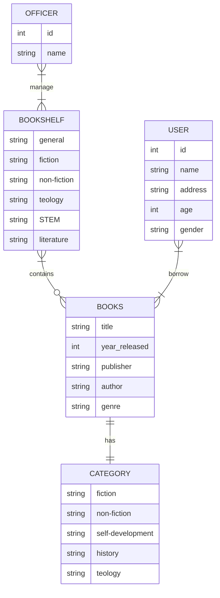

<!-- membuat erd sistem perpustakaan
buku, kategori, rak_buku, petugas, peminjam
tentukan relasi dan kardinalitas
tentukan tiap atribut untuk entitas
-->
---
title : Library ERD
---

```mermaid

erDiagram
    direction TB
    
    BOOKS {
        string title
        int year_released
        string publisher
        string author
        string genre
    }

    CATEGORY {
        string fiction
        string non-fiction
        string self-development
        string history
        string teology
    }

    BOOKSHELF {
        string general
        string fiction
        string non-fiction
        string teology
        string STEM
        string literature
    }

    OFFICER {
        int id
        string name
    }

    USER {
        int id
        string name
        string address
        int age
        string gender
    }

BOOKS ||--|| CATEGORY : has 
BOOKSHELF }|--o{ BOOKS : contains
OFFICER }|--|{ BOOKSHELF : manage
USER }|--|{ BOOKS : borrow
```