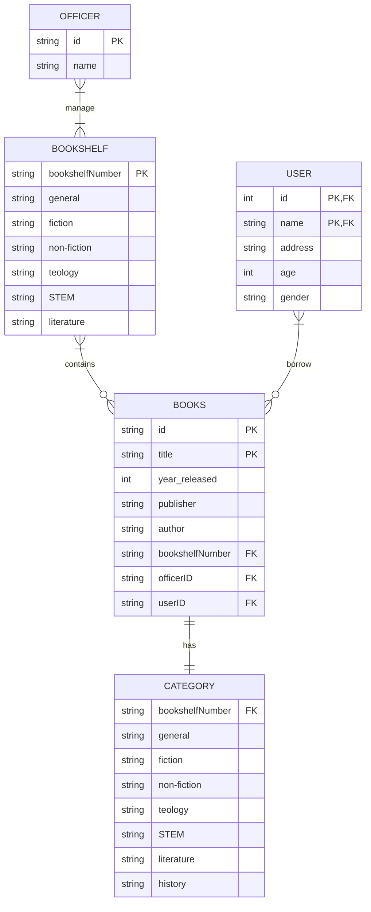

```mermaid

erDiagram
    direction TB
    
    BOOKS {
        string id PK
        string title PK
        int year_released
        string publisher
        string author
        string bookshelfNumber FK
        string officerID FK
        string userID FK
    }

    CATEGORY {
        string bookshelfNumber FK
        string general
        string fiction
        string non-fiction
        string teology
        string STEM
        string literature
        string history
    }

    BOOKSHELF {
        string bookshelfNumber PK
        string general
        string fiction
        string non-fiction
        string teology
        string STEM
        string literature
    }

    OFFICER {
        string id PK
        string name
    }

    USER {
        int id PK, FK
        string name PK, FK
        string address
        int age
        string gender
    }

BOOKS ||--|| CATEGORY : has 
BOOKSHELF }|--o{ BOOKS : contains
OFFICER }|--|{ BOOKSHELF : manage
USER }|--o{ BOOKS : borrow
```