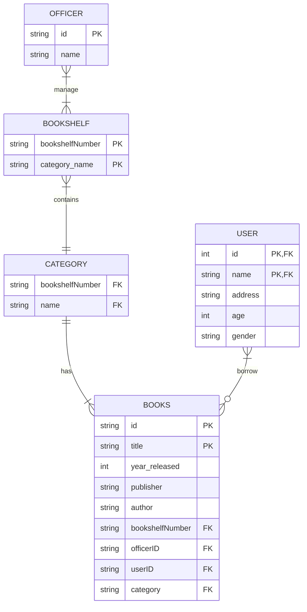

```mermaid

erDiagram
    direction TB
    
    BOOKS {
        string id PK
        string title PK
        int year_released
        string publisher
        string author
        string bookshelfNumber FK
        string officerID FK
        string userID FK
        string category FK
    }

    CATEGORY {
        string bookshelfNumber FK
        string name FK
    }

    BOOKSHELF {
        string bookshelfNumber PK
        string category_name PK
    }

    OFFICER {
        string id PK
        string name
    }

    USER {
        int id PK, FK
        string name PK, FK
        string address
        int age
        string gender
    }

CATEGORY ||--|{ BOOKS : has 
BOOKSHELF }|--|| CATEGORY : contains
OFFICER }|--|{ BOOKSHELF : manage
USER }|--o{ BOOKS : borrow
```

<!-- string general
string fiction
string non-fiction
string teology
string STEM
string literature -->