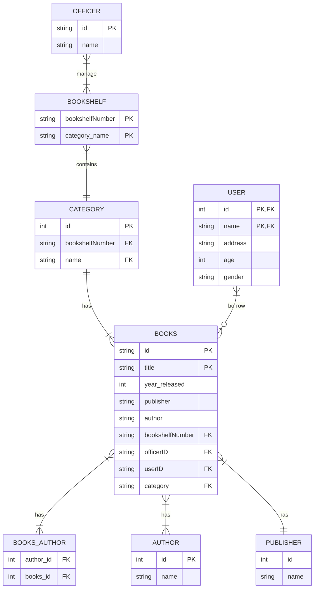

```mermaid
erDiagram
    direction TB
    
    BOOKS {
        string id PK
        string title PK
        int year_released
        string publisher
        string author
        string bookshelfNumber FK
        string officerID FK
        string userID FK
        string category FK
    }

    CATEGORY {
        int id PK
        string bookshelfNumber FK
        string name FK
    }

    BOOKSHELF {
        string bookshelfNumber PK
        string category_name PK
    }

    OFFICER {   
        string id PK
        string name
    }

    USER {
        int id PK, FK
        string name PK, FK
        string address
        int age
        string gender
    }

    AUTHOR {
        int id PK
        string name
    }

    BOOKS_AUTHOR{
        int author_id FK
        int books_id FK
    }

    PUBLISHER {
        int id
        sring name
    }

CATEGORY ||--|{ BOOKS : has 
BOOKSHELF }|--|| CATEGORY : contains
OFFICER }|--|{ BOOKSHELF : manage
USER }|--o{ BOOKS : borrow
BOOKS }|--|{ BOOKS_AUTHOR :has
BOOKS }|--|{ AUTHOR :has
BOOKS }|--|| PUBLISHER :has
```